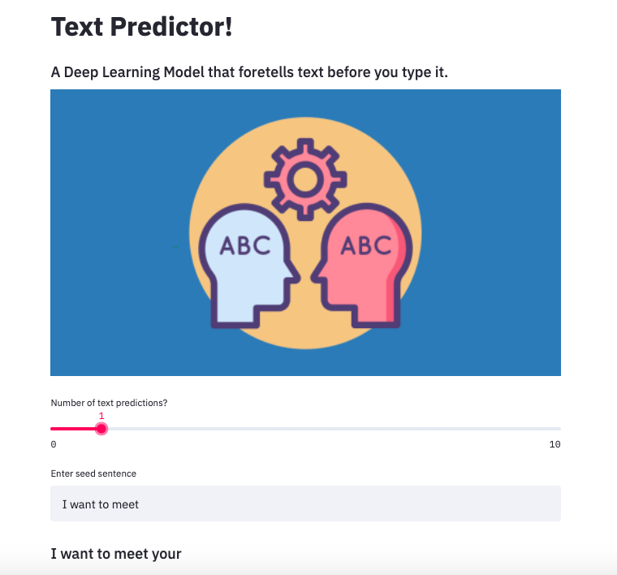
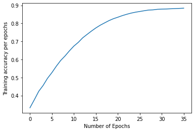
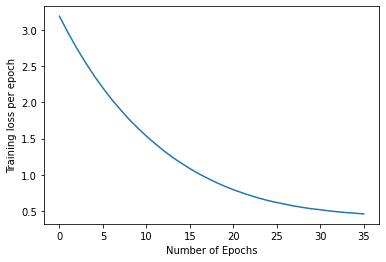

# streamlit_text_predictor

<h2>The Dataset</h2>
In order to train this sequence model, the popular Drama/Indie screenplay Good Will Hunting was used.
This corpus comprised of a total of 3293 unique words.
Data preprocessing steps included removing whitespaces from the text file, converting the texts to lowercase and tokenizing them.
<h2>Architecture</h2>
The model uses 3 layers in total:
  1) An Embedding Layer 
  2) A Bidirectional LSTM layer with 150 units
  3) A Dense Layer with SOFTMAX Activation.
<h2>Performance</h2>
The model was trained using the Adam optimizer with Categorical Cross-Entropy as the loss function.
Over 30-35 epochs, the training converged with an accuracy close to 90% with an average loss close to 0.5.
<h4>Accuracy Curve</h4>

<h4>Loss Curve</h4>

<h2>Predictions</h2>
Lets see some examples to analyse how our model did to predict texts, for this we will feed the model with a seed text to to give our model some perception for it to know in what sense we want it to generate the texts.
1)
Seed: Lets go ->
Predicted text: Lets go out. ->
2)
Seed: I want to meet ->
Predicted text: I want to meet your.
<h2>Install</h2>
For you to run this project on your local machine, streamlit must be installed.
<h4>$ pip install streamlit</h4>
After doing the installation, clone this repository. From your command line interface, toggle to this directory and give the following command:
<h4>$ streamlit run app.py</h4>

